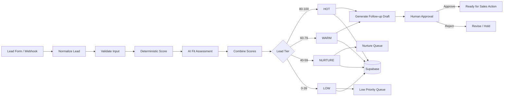

# AI Lead Qualification Agent

A production-style **AI lead qualification and routing workflow** built with **n8n, LLMs, deterministic scoring, and optional Supabase persistence**.

The project demonstrates how inbound leads can be normalized, assessed against an Ideal Customer Profile (ICP), scored with a combination of business rules and AI judgment, routed by priority, and prepared for human-approved follow-up.

> **Portfolio project:** all companies, lead records, scoring criteria, and sample data in this repository are fictional.

## What this project demonstrates

- Webhook-based lead intake
- Lead normalization and validation
- Structured LLM extraction
- Deterministic scoring rules
- AI-assisted fit assessment
- Combined lead score
- Hot / Warm / Nurture / Low routing
- Human approval before high-impact follow-up
- Supabase/PostgreSQL persistence
- Audit logging and explainable score breakdowns
- Failure-safe workflow design

## Architecture



## Why combine AI with deterministic scoring?

An LLM is useful for interpreting messy text such as:

- "We need to automate our inbound support before Q4."
- "Looking for an AI workflow for a 40-person sales team."
- "Just exploring options right now."

But core business rules should remain visible and auditable.

This project therefore separates:

**Deterministic signals**

- company size
- job seniority
- business email vs personal email
- budget range
- project timeline
- source
- explicit buying intent

from:

**AI-assessed signals**

- problem clarity
- urgency
- use-case fit
- intent strength

The final score is calculated from both rather than letting the LLM make the entire decision.

## Example scoring model

| Signal | Points |
|---|---:|
| Decision maker / senior role | +15 |
| Company size in ICP range | +15 |
| Business email | +10 |
| Budget aligned with target | +15 |
| Timeline under 90 days | +15 |
| Clear business problem | +10 |
| High AI intent score | +20 |

Maximum score: **100**

### Routing

| Score | Tier | Action |
|---|---|---|
| 80–100 | Hot | Immediate sales review + follow-up draft |
| 60–79 | Warm | Sales follow-up queue |
| 40–59 | Nurture | Add to nurture workflow |
| 0–39 | Low | Log for later review |

## Repository structure

```text
.
├── workflow/
│   └── ai-lead-qualification-agent.json
├── supabase/
│   └── schema.sql
├── examples/
│   └── sample-leads.json
├── docs/
│   ├── architecture.md
│   └── scoring-model.md
├── .env.example
├── LICENSE
└── README.md
```

## Example input

```json
{
  "first_name": "Aisha",
  "last_name": "Mehta",
  "email": "aisha@northstarops.com",
  "company": "Northstar Operations",
  "job_title": "Head of Operations",
  "company_size": 85,
  "budget_range": "5000-10000",
  "timeline": "30-60 days",
  "message": "We want to automate lead routing and follow-up across our sales team.",
  "source": "website"
}
```

## Example output

```json
{
  "lead_score": 88,
  "tier": "HOT",
  "deterministic_score": 68,
  "ai_fit_score": 20,
  "reasoning": "Strong ICP fit, senior decision-maker, clear automation need and near-term timeline.",
  "recommended_action": "Prepare sales follow-up for human approval."
}
```

## Workflow stages

### 1. Intake
Receives inbound lead data through an n8n webhook.

### 2. Normalize
Converts incoming fields to a consistent schema and derives useful fields such as business-email status.

### 3. Deterministic scoring
Applies visible business rules using JavaScript rather than hiding them inside a prompt.

### 4. AI fit assessment
Uses an LLM only for signals that require language interpretation.

### 5. Combined score
Produces a 0–100 score and lead tier.

### 6. Routing
Routes leads into Hot, Warm, Nurture, or Low Priority paths.

### 7. Human-approved follow-up
High-priority leads receive an AI-generated follow-up draft, but the workflow does not treat AI output as automatically approved.

### 8. Persistence and audit
The optional Supabase schema stores the score breakdown, routing result, and processing history.

## Setup

### 1. Import the workflow

Import:

```
workflow/ai-lead-qualification-agent.json
```

into n8n.

### 2. Connect an LLM

The portfolio workflow uses an OpenAI-compatible n8n chat-model node by default. It can be replaced with another supported provider.

### 3. Optional: connect Supabase

Run:

```
supabase/schema.sql
```

in a test/local Supabase instance.

The qualification logic itself can still be inspected without Supabase.

### 4. Send a test lead

POST a JSON payload to the webhook:

```bash
curl -X POST https://YOUR_N8N_DOMAIN/webhook/lead-qualification \
  -H "Content-Type: application/json" \
  -d @examples/sample-leads.json
```

## Design principles

### AI interprets; business rules decide
The model is used where language understanding adds value. Important routing thresholds remain explicit.

### Explainable scoring
The output includes a breakdown so a reviewer can see why a lead received its tier.

### Human approval for consequential action
A generated follow-up is treated as a draft, not an automatic final action.

### External enrichment is optional
Paid services such as Apollo or Clearbit are not required for the base portfolio project. They can be added later.

## Planned validation

Before this project is marked as tested, the workflow will be run against a small test set covering:

- strong ICP lead
- medium-fit lead
- low-intent lead
- personal-email lead
- missing optional fields
- malformed input
- ambiguous intent
- human-approval path

Execution screenshots and results will be added after validation.

## Project background

This repository is a **public portfolio implementation of business-automation patterns I use in private workflow projects**.

The public version was built from scratch with fictional lead data, an explicit scoring model, AI-assisted intent assessment, routing logic, and human-review controls so the system can be demonstrated without exposing any private client or production implementation.

The scoring model, workflow structure, prompts, examples, and documentation in this repository were created specifically for this portfolio project.

## License

MIT License. See [LICENSE](LICENSE).
